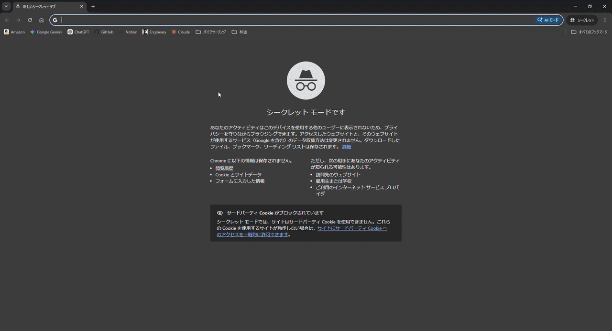
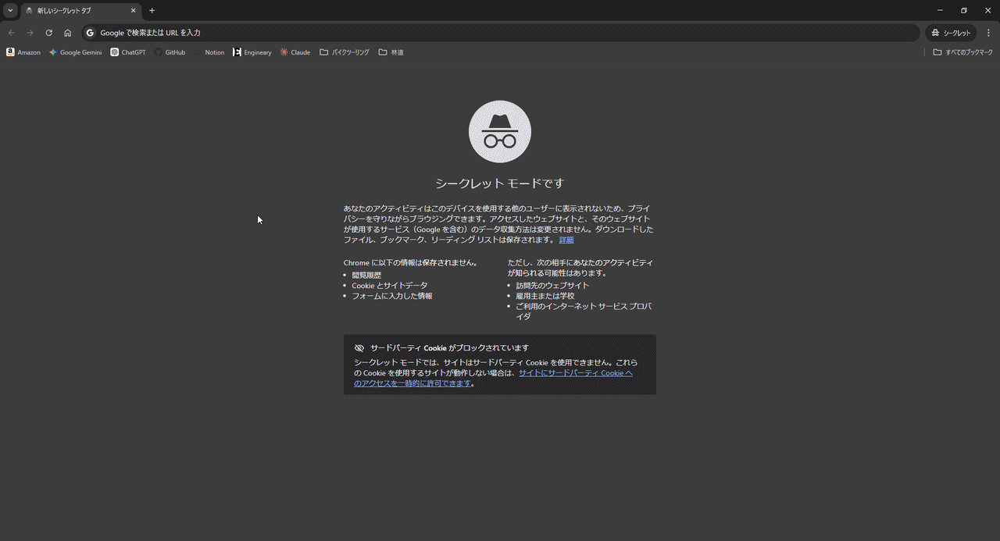

# Engineary

> **非Web 系エンジニアが、Web アプリ開発の基礎を自力で固めるために作ったポートフォリオ。**

---

## 目次

- [このプロジェクトについて](#このプロジェクトについて)
- [技術スタック](#技術スタック)
- [機能一覧](#機能一覧)
- [セットアップ](#セットアップ)
- [ファイル構成](#ファイル構成)
- [特に見てほしいファイル](#特に見てほしいファイル)
- [技術選定の考え方](#技術選定の考え方)
- [設計・実装で意識したこと](#設計実装で意識したこと)
- [AI の使い方について](#ai-の使い方について)
- [作者](#作者)

---

## このプロジェクトについて

現職では大規模公共系システムのバッチ処理を担当しており、  
詳細設計〜結合試験を経験した一方で、Web アプリケーション開発の経験はありませんでした。

Web 系自社開発への転職にあたり、自分に不足していると判断したのは以下の点です。

- HTTP 通信・REST API の仕組みへの理解
- フロントエンド構築の経験
- GitHub を使ったバージョン管理・チーム開発の作法
- モダンな Web 開発での設計・テストの経験

**Engineary** はそれらを補うために開発した、業務日誌・メモ管理 Web アプリです。  
現職がバックエンドのバッチ処理であるため、**バックエンドの設計・実装を学習のメイン**に置きつつ、フロントは React 等のフレームワークを使わず Vanilla JS で構築しました。

---

## 技術スタック

| カテゴリ | 技術 |
|---|---|
| バックエンド | Java 21 / Spring Boot 4.x |
| DB | SQLite / Spring Data JPA / Hibernate |
| フロントエンド | Vanilla JS (ES Modules) / Bootstrap 5 |
| テスト（バック） | JUnit 5 / Mockito / MockMvc |
| テスト（フロント） | Vitest |
| ビルド | Maven |
| その他 | Lombok / Spring Validation / Postman |

---

## 機能一覧

### 日誌管理（Diary）
- 一覧表示（ページネーション対応）
- 新規作成 / 編集 / 削除

### メモ管理（Memo）
- 一覧表示（ページネーション対応）
- 新規作成 / 編集 / 削除

### UI / UX
- SPA 構成（クライアントサイドルーティング）
- トースト通知によるフィードバック表示

---

## デモ

**作成**  




**削除**  




---

## セットアップ

**必要な環境:** Java 21 以上 / Maven 3.x 以上

```bash
# リポジトリをクローン
git clone https://github.com/your-username/engineary.git
cd engineary

# 起動
mvn spring-boot:run
```

起動後、`http://localhost:8080` にアクセス。

---

## ファイル構成

```
src/main/
├── java/com/example/engineary/
│   ├── controller/        # HTTP の受け口。Service への委譲のみ
│   ├── service/           # ビジネスロジック
│   ├── repository/        # DB 操作（Spring Data JPA）
│   ├── model/             # Entity
│   ├── dto/               # Request / Response（バリデーションもここに集約）
│   ├── mapper/            # Entity <-> DTO 変換
│   ├── config/            # CORS・MVC 設定
│   └── exception/         # 例外・グローバルハンドラ
└── resources/
    └── static/js/
        ├── app.js          # エントリポイント
        ├── router.js       # クライアントサイドルーティング
        ├── apifetch.js     # API 通信共通処理
        ├── components/     # ページネーション・トースト等
        └── views/          # 機能ごとの UI・CRUD・バリデーション
```

---

## 特に見てほしいファイル

責務が混合しやすい箇所を意識して分離した実装です。

| ファイル | 責務 | 見どころ |
|---|---|---|
| `controller/DiaryEntryController.java` | HTTP の受け口 | ビジネスロジックを一切持たず、Service への委譲のみ |
| `service/DiaryEntryService.java` | ビジネスロジック | HTTP・DB の詳細を知らず、DTO と Entity のみ扱う |
| `exception/GlobalExceptionHandler.java` | 統一エラー管理 | 例外の種類ごとに固定メッセージを返し、スタックトレース等のサーバー内部情報をフロントに漏洩させない |
| `static/js/apifetch.js` | API 通信共通処理 | バックエンドの統一エラー形式（ProblemDetail）を受け取り、フロント全体のエラーハンドリングを一元化 |

---

## 技術選定の考え方

| 選択 | 理由 |
|---|---|
| Spring Boot | 現職で使う Java / Spring の延長として選択。いきなりモダン FW を使わず、土台を固めることを優先した |
| Vanilla JS | React 等に依存せず DOM 操作・HTTP 通信を自分の手で書くことで、「ブラウザと API の間で何が起きているか」を理解する |
| レイヤードアーキテクチャ | Controller / Service / Repository の責務分離を徹底。修正・分業のしやすさ、可読性の向上を意識した |
| SQLite / JPA | 簡易的な CRUD が目的のため、DB サーバーの構築コストを排除し実装に集中するために選択。ORM により SQL を直接扱わず、オブジェクト操作で DB を扱える |

---

## 設計・実装で意識したこと

### 1. 依存性の排除・責務の分離

```
Controller  →  Service  →  Repository
      DTO (Request / Response)
      Mapper（Entity <-> DTO 変換）
```

各レイヤーが互いの実装に依存しない構造にしました。  
「どこを修正すればいいか」が明確になり、チーム開発での分業や保守に強い設計です。

### 2. フロントエンド設計（Vanilla JS / ES Modules）

フレームワークを使わず、ES Modules で機能ごとにファイルを分割しました。  
これにより「React が何を解決しているか」を自分の経験として理解しました。

### 3. セキュリティ対策

・ **XSS 対策**  
DOM へのデータ描画は `innerHTML` を使わず `textContent` で統一しています。  
Vanilla JS で DOM 操作を自前実装したことで XSS の発生経路を肌で理解した上での実装です。

・ **CORS 設定**  
`CorsConfig` で許可オリジン・メソッド・ヘッダーを明示的に制限し、  
意図しないオリジンからの API アクセスを遮断しています。

・ **エラーメッセージによるサーバー情報漏洩対策**  
`GlobalExceptionHandler` で例外の種類ごとに固定の日本語メッセージを返す設計にしています。  
スタックトレースや内部クラス名はログにのみ出力し、フロントには返しません。  
これにより、エラーメッセージを通じたサーバー内部構造の推測を防いでいます。

・ **認証・認可について**  
本プロジェクトは SQLite を使用しローカル環境のみで動作するため、デプロイを前提とした認証・認可の実装は不要と判断しました。  
ただし実務では必須の要件であるという認識はあり、次のポートフォリオで認証・認可を用いた実装を行う予定です。

### 4. テスト設計

バックエンドは Controller / Service / Mapper の各レイヤーに対して JUnit 5 / Mockito / MockMvc で、  
フロントエンドはバリデーション・UI ロジックを Vitest で単体テストを実装しました。  
いずれも正常系・異常系・境界値・準正常系の観点で設計しています。

---

## AI の使い方について

AIは非常に便利なツールですが、初学者がバイブコーディングおよびAI生成コードをRVする方法でのコーディング・設計を行った場合に、

・実装するために何が必要でどんな手順で作ればいいという**問題解決能力**が身につかない。  
・設計を行う上で何がどのくらいの時間で実現可能かなどの**勘が身につかない**。  

  という問題があります。  

つまり、生成されたコードを読むだけでは知識の蓄積になるが、エンジニアとしての本質的な思考能力が身に付かないと考えました。以上の理由から、本プロジェクトはAIを補助的な役割として限定的な使用にとどめています。

---

## 作者

- GitHub: [@Shin0005](https://github.com/Shin0005)